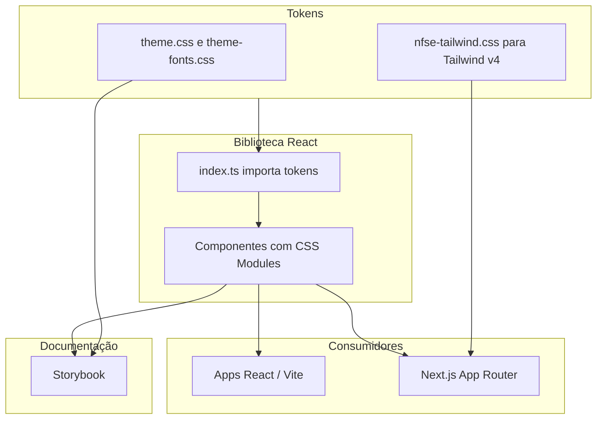

# Arquitetura

O `nfse-ds` é uma **biblioteca de componentes React** com estilos baseados em **variáveis CSS** (design tokens), empacotada com **Vite** e documentada no **Storybook**. A identidade visual segue o PRD e a referência oficial da NFS-e (cores, Roboto, acessibilidade).

## Visão em camadas

### 1. Tokens (fonte de verdade visual)

- **`src/tokens/theme.css`**: variáveis `:root` — cores primárias e semânticas, tipografia, espaçamento (grid 8px), raios, bordas e foco acessível.
- **`src/tokens/theme-fonts.css`**: carregamento da família **Roboto** (Google Fonts no build atual; alternativa documentada: `@fontsource/roboto` offline).
- **`src/tokens/nfse-tailwind.css`**: bloco `@theme` para **Tailwind CSS v4**, alinhado aos mesmos valores de marca (utilitários `bg-*`, `text-*`, etc., quando o app importa Tailwind).

Alterações de marca devem ser feitas primeiro nos tokens e replicadas de forma consistente no bloco Tailwind.

### 2. Componentes

- Implementação em **React 19** + **TypeScript**.
- Estilos por componente via **CSS Modules** (`.module.css`), referenciando `var(--nfse-*)`.
- Não é obrigatório que o app consumidor use Tailwind: basta importar os CSS de tema + o bundle da lib.

### 3. Build da biblioteca

- Configuração em `vite.config.lib.ts`: modo `lib`, entrada `src/index.ts`, `react`/`react-dom` como **externals**.
- **`vite-plugin-dts`**: geração de `.d.ts` para consumo TypeScript.
- **`vite-plugin-static-copy`**: cópia dos arquivos CSS de tokens para `dist/` (com script auxiliar `scripts/flatten-token-css.mjs` para raiz de `dist/`).
- Saída: `dist/index.js`, `dist/index.css`, `dist/theme.css`, `dist/theme-fonts.css`, `dist/nfse-tailwind.css`, tipos espelhando `src/`.

### 4. Consumo

| Cenário | O que importar |
|--------|----------------|
| **React (Vite, etc.)** | `nfse-ds/theme-fonts.css`, `nfse-ds/theme.css`, depois `import { ... } from 'nfse-ds'`. |
| **Next.js + Tailwind v4** | No CSS global: `@import 'tailwindcss'` e `@import 'nfse-ds/nfse-tailwind.css'`; no layout: fontes + `theme.css`; componentes interativos em Client Components (`'use client'`). |

### 5. Storybook

- Ambiente de desenvolvimento e **portal de documentação** (variantes, Autodocs, integração), não só canvas visual — ver [storybook-documentation.md](storybook-documentation.md).
- Stories por componente, addon **a11y**, páginas agregadas (**NFS-e / Design System Overview**, **Layouts**, **Recipes**).
- O preview importa os mesmos tokens que a biblioteca, garantindo paridade visual com o pacote publicado.

## Princípios

1. **Um único conjunto de tokens** evita divergência entre apps Tailwind e não-Tailwind.
2. **Componentes sem dependência obrigatória de Tailwind** ampliam onde o DS pode ser usado.
3. **Acessibilidade** (foco visível, ARIA, contraste) é requisito, não opcional; validação contínua no Storybook.
